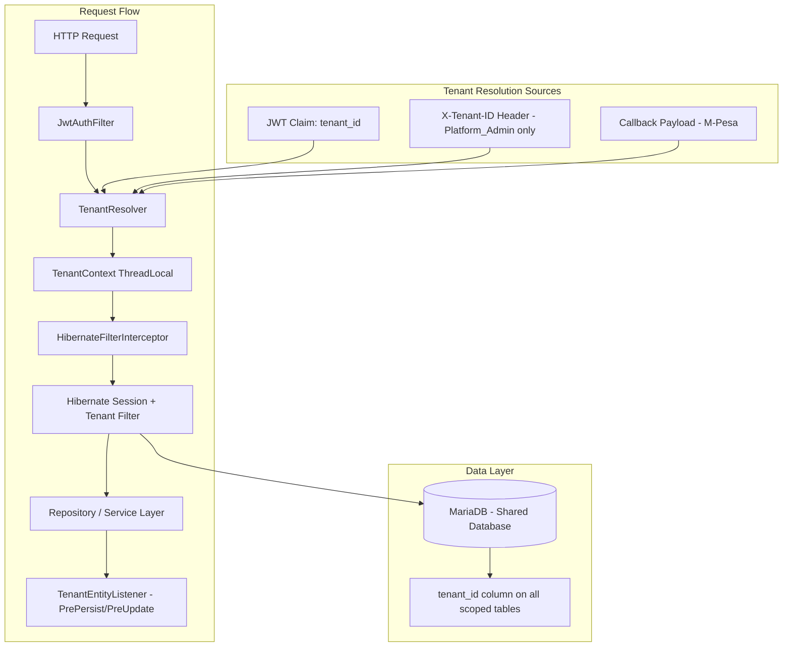

# Design Document: Multi-Tenancy

## Overview

This design converts the EduPoa school management system from a single-tenant monolithic Spring Boot application into a multi-tenant platform using the **shared database with discriminator column** strategy. Every tenant-scoped entity gets a `tenant_id` column, and Hibernate Filters automatically scope all queries to the current tenant. Tenant context is resolved from JWT claims on every request and stored in a `ThreadLocal` holder.

### Key Design Decisions

1. **Shared Database with Discriminator Column** — chosen over schema-per-tenant or database-per-tenant for simplicity, lower operational cost, and compatibility with the existing MariaDB setup. Trade-off: requires framework-level enforcement of data isolation rather than database-level guarantees.
2. **Hibernate Filters** — chosen over custom query rewriting or Spring Data specifications because they transparently apply to all JPQL/HQL queries (including those from Spring Data JPA repositories) without requiring changes to every query method.
3. **ThreadLocal Tenant Context** — aligns with Spring's request-scoped model and the existing synchronous servlet architecture. Each request thread has exactly one tenant context.
4. **JWT-based Resolution** — tenant identifier stored as a JWT claim eliminates the need for subdomain configuration or per-request tenant headers for standard operations.

## Architecture



### Request Lifecycle

1. `JwtAuthFilter` authenticates the user and extracts the JWT token
2. `TenantResolverFilter` (new filter, runs after JwtAuthFilter) extracts `tenant_id` from JWT claims (or X-Tenant-ID header for Platform_Admin)
3. `TenantContext.setCurrentTenant(tenantId)` stores the tenant in a ThreadLocal
4. `HibernateFilterInterceptor` (Spring MVC interceptor) enables the `tenantFilter` on the Hibernate session with the resolved tenant_id
5. All JPA queries on tenant-scoped entities automatically include `WHERE tenant_id = :tenantId`
6. `TenantEntityListener` validates and auto-populates `tenant_id` on persist/update operations
7. After request completes, `TenantContext.clear()` removes the ThreadLocal value

## Components and Interfaces

### New Package Structure

```
com.EduePoa.EP.Multitenancy/
├── config/
│   ├── TenantContext.java
│   ├── TenantResolverFilter.java
│   ├── HibernateFilterInterceptor.java
│   └── MultitenancyConfig.java
├── entity/
│   ├── Tenant.java
│   ├── TenantConfiguration.java
│   └── TenantAuditLog.java
├── listener/
│   └── TenantEntityListener.java
├── repository/
│   ├── TenantRepository.java
│   ├── TenantConfigurationRepository.java
│   └── TenantAwareRepository.java (base interface)
├── service/
│   ├── TenantService.java
│   ├── TenantServiceImpl.java
│   ├── TenantProvisioningService.java
│   └── TenantLifecycleService.java
├── controller/
│   └── TenantController.java
├── dto/
│   ├── TenantRegistrationRequest.java
│   ├── TenantResponse.java
│   └── TenantConfigurationDto.java
├── annotation/
│   └── TenantScoped.java
└── base/
    └── TenantScopedEntity.java (mapped superclass)
```

### Core Interfaces

```java
// TenantContext - ThreadLocal holder
public final class TenantContext {
    private static final ThreadLocal<String> currentTenant = new ThreadLocal<>();
    
    public static void setCurrentTenant(String tenantId) { ... }
    public static String getCurrentTenant() { ... }
    public static void clear() { ... }
    public static boolean isSet() { ... }
}

// TenantScopedEntity - Base mapped superclass
@MappedSuperclass
@FilterDef(name = "tenantFilter", parameters = @ParamDef(name = "tenantId", type = String.class))
@Filter(name = "tenantFilter", condition = "tenant_id = :tenantId")
@EntityListeners(TenantEntityListener.class)
public abstract class TenantScopedEntity {
    @Column(name = "tenant_id", nullable = false, updatable = false)
    private String tenantId;
}

// TenantAwareRepository - Base repository
@NoRepositoryBean
public interface TenantAwareRepository<T extends TenantScopedEntity, ID> 
    extends JpaRepository<T, ID> {
}

// TenantEntityListener - JPA lifecycle listener
public class TenantEntityListener {
    @PrePersist
    public void prePersist(TenantScopedEntity entity) { ... }
    
    @PreUpdate
    public void preUpdate(TenantScopedEntity entity) { ... }
}

// TenantResolverFilter - Servlet filter
public class TenantResolverFilter extends OncePerRequestFilter {
    @Override
    protected void doFilterInternal(HttpServletRequest request, 
        HttpServletResponse response, FilterChain filterChain) { ... }
}

// HibernateFilterInterceptor - MVC interceptor
public class HibernateFilterInterceptor implements HandlerInterceptor {
    @Override
    public boolean preHandle(HttpServletRequest request, 
        HttpServletResponse response, Object handler) { ... }
    
    @Override
    public void afterCompletion(HttpServletRequest request, 
        HttpServletResponse response, Object handler, Exception ex) { ... }
}
```

### Modified Existing Components

| Component | Change |
|-----------|--------|
| `User` entity | Extends `TenantScopedEntity`, unique constraint becomes `(email, tenant_id)` |
| `Role` entity | Extends `TenantScopedEntity` |
| `Student` entity | Extends `TenantScopedEntity` |
| `JwtService` | Adds `tenant_id` claim to token generation and extraction |
| `JwtAuthFilter` | Coordinates with `TenantResolverFilter` (which now handles tenant extraction) |
| `SecurityConfig` | Registers `TenantResolverFilter` in the filter chain |
| `AuthService` | Validates user-tenant association on login |
| `UserRepository` | Extends `TenantAwareRepository` |
| All module entities | Extend `TenantScopedEntity` (FeeStructure, Grade, Invoice, Expense, Transport, etc.) |
| All module repositories | Extend `TenantAwareRepository` |
| M-Pesa services | Load credentials from `TenantConfiguration` |
| Communications services | Load sender config from `TenantConfiguration` |
| Reports services | Inject tenant branding from `TenantConfiguration` |

### Default Role Provisioning and Backfill

Because `Role` extends `TenantScopedEntity`, roles are scoped per tenant and all `RoleRepository` lookups are filtered by the active `TenantContext`. Dependent modules resolve roles by name within the current tenant:

- Parent onboarding resolves `ROLE_PARENT`
- Supplier onboarding resolves `SUPPLIER`
- Tenant provisioning creates `School_Admin`

Two distinct concerns must be addressed to guarantee these roles are always resolvable:

1. **New tenants** — `TenantProvisioningService.provisionTenant()` runs inside the target `TenantContext` and seeds `School_Admin`, `ROLE_PARENT`, and `SUPPLIER` via `createDefaultRoles()`. This is idempotent: each role is created only if `roleRepository.findByName(...)` returns empty for the current tenant.

2. **Pre-existing (migrated) tenants** — The single-tenant `bureti-high` data predates the default-role seeding logic. Its schema received a `tenant_id` column via `V2__add_multitenancy.sql`, but no migration ever seeded `SUPPLIER` / `ROLE_PARENT` rows for it. This is the source of the runtime error `Role 'SUPPLIER' not found. Please seed the roles table.` A backfill migration (`V3__seed_default_roles_existing_tenants.sql`) seeds the missing default roles for every existing tenant that lacks them, keyed on `(name, tenant_id)`.

To defend against future drift and any not-yet-provisioned tenant, module-level role resolution follows a **self-healing lookup** pattern (already used by `StudentServiceImpl` for `ROLE_PARENT`): resolve the role by name within the current tenant, and if absent, create it in the current tenant before use rather than throwing.

```java
// Self-healing role resolution within the current TenantContext
Role supplierRole = roleRepository.findByName("SUPPLIER")
        .orElseGet(() -> {
            Role role = new Role();
            role.setName("SUPPLIER");
            role.setEnabledFlag('Y');
            role.setDeletedFlag('N');
            role.setStatus(Status.ACTIVE);
            return roleRepository.save(role); // tenant_id auto-populated by TenantEntityListener
        });
```

This keeps role resolution resilient across three scenarios: freshly provisioned tenants (seeded), migrated tenants (backfilled), and any tenant where seeding was missed (self-healed on first use). Because persistence runs under an active `TenantContext`, `TenantEntityListener` auto-populates the correct `tenant_id`, preserving isolation.

## Data Models

### New Entities

```java
@Entity
@Table(name = "tenants")
public class Tenant {
    @Id
    @GeneratedValue(strategy = GenerationType.IDENTITY)
    private Long id;

    @Column(name = "tenant_id", unique = true, nullable = false, updatable = false)
    private String tenantIdentifier;  // slug: "bureti-high"

    @Column(nullable = false)
    private String schoolName;

    private String physicalAddress;
    private String emailDomain;
    private String phoneNumber;
    private String logoUrl;

    @Enumerated(EnumType.STRING)
    @Column(nullable = false)
    private TenantStatus status;  // ACTIVE, SUSPENDED, DECOMMISSIONED

    @Column(nullable = false)
    private String subscriptionPlan;

    @CreationTimestamp
    private Timestamp createdOn;

    @UpdateTimestamp
    private Timestamp updatedOn;
}

@Entity
@Table(name = "tenant_configurations")
public class TenantConfiguration {
    @Id
    @GeneratedValue(strategy = GenerationType.IDENTITY)
    private Long id;

    @Column(name = "tenant_id", nullable = false)
    private String tenantIdentifier;

    @Column(nullable = false)
    private String configKey;   // e.g., "mpesa.shortcode", "sms.sender_id"

    @Column(columnDefinition = "TEXT")
    private String configValue; // encrypted for sensitive values

    private Boolean isSensitive;  // flag for encryption
}

@Entity
@Table(name = "tenant_audit_logs")
public class TenantAuditLog {
    @Id
    @GeneratedValue(strategy = GenerationType.IDENTITY)
    private Long id;

    @Column(name = "tenant_id", nullable = false)
    private String tenantIdentifier;

    @Column(nullable = false)
    private String action;  // CREATED, SUSPENDED, REACTIVATED, DECOMMISSIONED

    @Column(nullable = false)
    private String actor;   // username of Platform_Admin

    private String reason;

    @CreationTimestamp
    private Timestamp timestamp;
}

public enum TenantStatus {
    ACTIVE,
    SUSPENDED,
    DECOMMISSIONED
}
```

### Modified Entity: User

```java
@Entity
@Table(uniqueConstraints = {
    @UniqueConstraint(columnNames = {"email", "tenant_id"})
})
public class User extends TenantScopedEntity implements UserDetails {
    // ... existing fields remain ...
    // Remove @Column(unique = true) from email
    // The (email, tenant_id) composite unique constraint replaces it
}
```

### Database Migration (Flyway/Liquibase)

```sql
-- V2__add_multitenancy.sql

-- 1. Create tenants table
CREATE TABLE tenants (
    id BIGINT AUTO_INCREMENT PRIMARY KEY,
    tenant_id VARCHAR(63) NOT NULL UNIQUE,
    school_name VARCHAR(255) NOT NULL,
    physical_address VARCHAR(500),
    email_domain VARCHAR(255),
    phone_number VARCHAR(20),
    logo_url VARCHAR(500),
    status VARCHAR(20) NOT NULL DEFAULT 'ACTIVE',
    subscription_plan VARCHAR(50) NOT NULL DEFAULT 'BASIC',
    created_on TIMESTAMP DEFAULT CURRENT_TIMESTAMP,
    updated_on TIMESTAMP DEFAULT CURRENT_TIMESTAMP ON UPDATE CURRENT_TIMESTAMP
);

-- 2. Create default tenant for existing data
INSERT INTO tenants (tenant_id, school_name, status, subscription_plan)
VALUES ('bureti-high', 'Bureti High School', 'ACTIVE', 'PREMIUM');

-- 3. Add tenant_id column to all tenant-scoped tables
ALTER TABLE user ADD COLUMN tenant_id VARCHAR(63) NOT NULL DEFAULT 'bureti-high';
ALTER TABLE role ADD COLUMN tenant_id VARCHAR(63) NOT NULL DEFAULT 'bureti-high';
ALTER TABLE student ADD COLUMN tenant_id VARCHAR(63) NOT NULL DEFAULT 'bureti-high';
ALTER TABLE grade ADD COLUMN tenant_id VARCHAR(63) NOT NULL DEFAULT 'bureti-high';
ALTER TABLE fee_structure ADD COLUMN tenant_id VARCHAR(63) NOT NULL DEFAULT 'bureti-high';
ALTER TABLE fee_components ADD COLUMN tenant_id VARCHAR(63) NOT NULL DEFAULT 'bureti-high';
ALTER TABLE expenses ADD COLUMN tenant_id VARCHAR(63) NOT NULL DEFAULT 'bureti-high';
ALTER TABLE student_invoices ADD COLUMN tenant_id VARCHAR(63) NOT NULL DEFAULT 'bureti-high';
ALTER TABLE finance ADD COLUMN tenant_id VARCHAR(63) NOT NULL DEFAULT 'bureti-high';
ALTER TABLE finance_transaction ADD COLUMN tenant_id VARCHAR(63) NOT NULL DEFAULT 'bureti-high';
ALTER TABLE transport ADD COLUMN tenant_id VARCHAR(63) NOT NULL DEFAULT 'bureti-high';
ALTER TABLE mpesa_stk_transactions ADD COLUMN tenant_id VARCHAR(63) NOT NULL DEFAULT 'bureti-high';
ALTER TABLE announcement ADD COLUMN tenant_id VARCHAR(63) NOT NULL DEFAULT 'bureti-high';
ALTER TABLE message ADD COLUMN tenant_id VARCHAR(63) NOT NULL DEFAULT 'bureti-high';
ALTER TABLE parent ADD COLUMN tenant_id VARCHAR(63) NOT NULL DEFAULT 'bureti-high';
ALTER TABLE audit ADD COLUMN tenant_id VARCHAR(63) NOT NULL DEFAULT 'bureti-high';

-- 4. Remove old unique constraint on email, add composite unique
ALTER TABLE user DROP INDEX email;
ALTER TABLE user ADD UNIQUE INDEX idx_user_email_tenant (email, tenant_id);

-- 5. Remove old unique constraint on role name, add composite unique
ALTER TABLE role DROP INDEX name;
ALTER TABLE role ADD UNIQUE INDEX idx_role_name_tenant (name, tenant_id);

-- 6. Add indexes for tenant_id on all tables
ALTER TABLE user ADD INDEX idx_user_tenant (tenant_id);
ALTER TABLE student ADD INDEX idx_student_tenant (tenant_id);
ALTER TABLE grade ADD INDEX idx_grade_tenant (tenant_id);
-- ... (similar for all tables)

-- 7. Create tenant_configurations table
CREATE TABLE tenant_configurations (
    id BIGINT AUTO_INCREMENT PRIMARY KEY,
    tenant_id VARCHAR(63) NOT NULL,
    config_key VARCHAR(255) NOT NULL,
    config_value TEXT,
    is_sensitive BOOLEAN DEFAULT FALSE,
    UNIQUE INDEX idx_tenant_config (tenant_id, config_key),
    FOREIGN KEY (tenant_id) REFERENCES tenants(tenant_id)
);

-- 8. Create tenant_audit_logs table
CREATE TABLE tenant_audit_logs (
    id BIGINT AUTO_INCREMENT PRIMARY KEY,
    tenant_id VARCHAR(63) NOT NULL,
    action VARCHAR(50) NOT NULL,
    actor VARCHAR(255) NOT NULL,
    reason TEXT,
    timestamp TIMESTAMP DEFAULT CURRENT_TIMESTAMP,
    INDEX idx_audit_tenant (tenant_id),
    FOREIGN KEY (tenant_id) REFERENCES tenants(tenant_id)
);
```

### Default Role Backfill Migration

```sql
-- V3__seed_default_roles_existing_tenants.sql
-- Seeds required default roles (ROLE_PARENT, SUPPLIER) for every existing
-- tenant that is missing them. School_Admin is intentionally left to
-- provisioning, since its permission set is assigned in code.
-- Idempotent: keyed on the composite (name, tenant_id) uniqueness.

INSERT INTO role (name, tenant_id, enabled_flag, deleted_flag, status)
SELECT 'ROLE_PARENT', t.tenant_id, 'Y', 'N', 'ACTIVE'
FROM tenants t
WHERE NOT EXISTS (
    SELECT 1 FROM role r WHERE r.name = 'ROLE_PARENT' AND r.tenant_id = t.tenant_id
);

INSERT INTO role (name, tenant_id, enabled_flag, deleted_flag, status)
SELECT 'SUPPLIER', t.tenant_id, 'Y', 'N', 'ACTIVE'
FROM tenants t
WHERE NOT EXISTS (
    SELECT 1 FROM role r WHERE r.name = 'SUPPLIER' AND r.tenant_id = t.tenant_id
);
```

### Rollback Migration

```sql
-- V2__rollback_multitenancy.sql
ALTER TABLE user DROP INDEX idx_user_email_tenant;
ALTER TABLE user ADD UNIQUE INDEX email (email);
ALTER TABLE user DROP COLUMN tenant_id;
-- ... (reverse for all tables)
DROP TABLE tenant_audit_logs;
DROP TABLE tenant_configurations;
DROP TABLE tenants;
```

## Correctness Properties

*A property is a characteristic or behavior that should hold true across all valid executions of a system — essentially, a formal statement about what the system should do. Properties serve as the bridge between human-readable specifications and machine-verifiable correctness guarantees.*

### Property 1: Tenant identifier uniqueness

*For any* two tenant registration requests with the same Tenant_Identifier, the second request SHALL be rejected with a conflict error, regardless of other differing fields.

**Validates: Requirements 1.4**

### Property 2: Tenant metadata persistence round-trip

*For any* valid tenant metadata (school name, address, email domain, phone, logo URL, subscription plan), persisting and then retrieving the Tenant record SHALL return all fields unchanged.

**Validates: Requirements 1.5**

### Property 3: JWT-to-TenantContext resolution pipeline

*For any* valid tenant identifier embedded as a claim in a JWT token, processing that token through the TenantResolverFilter SHALL result in TenantContext.getCurrentTenant() returning that exact identifier.

**Validates: Requirements 2.1, 2.2, 4.4, 10.1**

### Property 4: TenantContext cleanup after request

*For any* request processed by the system (regardless of tenant, outcome, or exception), after the response is committed TenantContext.getCurrentTenant() SHALL return null on that thread.

**Validates: Requirements 2.4**

### Property 5: TenantContext immutability during request

*For any* request being processed, from the moment TenantContext is set until the response is committed, successive calls to TenantContext.getCurrentTenant() within the same thread SHALL return the same value.

**Validates: Requirements 2.5**

### Property 6: Auto-population of tenant_id on persist

*For any* TenantScopedEntity that is persisted while a TenantContext is active, the entity's tenant_id field SHALL equal TenantContext.getCurrentTenant() after persistence completes.

**Validates: Requirements 3.2, 5.1**

### Property 7: Tenant filter data isolation

*For any* query against a TenantScopedEntity table while TenantContext is set to tenant T, every entity in the result set SHALL have tenant_id equal to T.

**Validates: Requirements 3.3, 5.2, 5.3**

### Property 8: Cross-tenant access prevention

*For any* attempt to access or modify a TenantScopedEntity whose tenant_id differs from the current TenantContext, the system SHALL reject the operation with a 403 Forbidden response.

**Validates: Requirements 3.4, 5.4**

### Property 9: Platform_Admin cross-tenant access

*For any* query executed while the authenticated user has the Platform_Admin role, the Tenant_Filter SHALL be disabled, and results MAY include entities from any tenant.

**Validates: Requirements 3.6**

### Property 10: JWT tenant claim inclusion

*For any* successful authentication, the issued JWT access token SHALL contain a `tenant_id` claim equal to the authenticated user's tenant_id.

**Validates: Requirements 4.1**

### Property 11: User-tenant validation on authentication

*For any* authentication attempt where the user's stored tenant_id does not match the tenant specified in the login request, the system SHALL reject the authentication.

**Validates: Requirements 4.2**

### Property 12: Email uniqueness within tenant, not across tenants

*For any* email address E and tenant T, at most one User with email E can exist within tenant T. However, *for any* two distinct tenants T1 and T2, a User with email E may exist in both.

**Validates: Requirements 4.3**

### Property 13: Inactive tenant rejection

*For any* JWT containing a tenant_id that maps to a non-ACTIVE tenant (SUSPENDED or DECOMMISSIONED or non-existent), the system SHALL reject the request with a 401 or 403 response.

**Validates: Requirements 2.3, 4.5**

### Property 14: Tenant-specific configuration resolution

*For any* tenant T with configuration entries, when a service (M-Pesa, SMS, Email, Reports) executes within TenantContext T, it SHALL use configuration values belonging to T and never values from another tenant.

**Validates: Requirements 6.1, 6.2, 6.3, 6.4**

### Property 15: Suspend and reactivate round-trip

*For any* active tenant that is suspended and then reactivated, all users of that tenant SHALL be able to authenticate successfully after reactivation, and all data SHALL remain unchanged throughout the cycle.

**Validates: Requirements 8.1, 8.2, 8.4**

### Property 16: Decommission prevents all access

*For any* tenant that is decommissioned, all queries against that tenant's data SHALL return empty results, and all authentication attempts for that tenant's users SHALL fail.

**Validates: Requirements 8.3**

### Property 17: Lifecycle audit logging completeness

*For any* tenant lifecycle state change (creation, suspension, reactivation, decommission), the system SHALL create an audit log entry containing the tenant identifier, action type, actor username, timestamp, and reason.

**Validates: Requirements 8.5**

### Property 18: Entity listener prevents contextless persistence

*For any* attempt to persist or update a TenantScopedEntity when TenantContext is not set OR when the entity's tenant_id does not match TenantContext, the system SHALL throw an exception and abort the transaction.

**Validates: Requirements 9.1, 9.2, 9.3**

### Property 19: Platform_Admin X-Tenant-ID override

*For any* request from a Platform_Admin user that includes an `X-Tenant-ID` header with a valid tenant identifier, TenantContext SHALL be set to the header value (overriding the JWT claim).

**Validates: Requirements 10.2**

### Property 20: Non-admin X-Tenant-ID header rejection

*For any* request from a non-Platform_Admin user that includes an `X-Tenant-ID` header with a value different from their JWT tenant claim, the system SHALL reject the request with 403 Forbidden.

**Validates: Requirements 10.3**

### Property 21: Error responses include tenant identifier

*For any* API error response generated while a TenantContext is active, the response body SHALL include the current tenant identifier.

**Validates: Requirements 10.4**

### Property 22: M-Pesa callback tenant resolution

*For any* M-Pesa STK callback payload containing an account reference or shortcode that maps to a known tenant, the TenantResolver SHALL resolve and set the correct tenant context without requiring JWT authentication.

**Validates: Requirements 10.5**

### Property 23: Default role resolvability within tenant scope

*For any* tenant T (whether newly provisioned, migrated from single-tenant, or seeded via self-healing lookup), resolving a required default role by name (School_Admin, ROLE_PARENT, SUPPLIER) while TenantContext is set to T SHALL return a Role whose tenant_id equals T, and SHALL NOT fail with a missing-role error.

**Validates: Requirements 1.6, 1.7, 7.6**

### Property 24: Default role seeding idempotency

*For any* tenant T, running default-role seeding (provisioning, backfill migration, or self-healing lookup) one or more times SHALL result in exactly one Role per default role name within T, never creating duplicates.

**Validates: Requirements 1.6, 7.6**

## Error Handling

### Error Categories and Responses

| Scenario | HTTP Status | Error Code | Response Body |
|----------|-------------|------------|---------------|
| Missing TenantContext on persist | 500 | `TENANT_CONTEXT_MISSING` | "Tenant context not established for this request" |
| Tenant_id mismatch on persist/update | 403 | `TENANT_MISMATCH` | "Operation violates tenant isolation" |
| Inactive tenant in JWT | 401 | `TENANT_INACTIVE` | "Tenant account is {suspended/decommissioned}" |
| Non-existent tenant in JWT | 401 | `TENANT_NOT_FOUND` | "Tenant not recognized" |
| Non-admin X-Tenant-ID override attempt | 403 | `TENANT_OVERRIDE_DENIED` | "Only platform administrators can override tenant context" |
| Duplicate tenant identifier | 409 | `TENANT_CONFLICT` | "Tenant identifier already exists: {id}" |
| Missing tenant configuration | 422 | `TENANT_CONFIG_MISSING` | "Required configuration '{key}' not found for tenant '{id}'" |
| Cross-tenant data access | 403 | `CROSS_TENANT_ACCESS` | "Access denied: resource belongs to a different tenant" |

### Error Response Structure

```json
{
  "timestamp": "2025-01-15T10:30:00Z",
  "status": 403,
  "error": "Forbidden",
  "code": "TENANT_MISMATCH",
  "message": "Operation violates tenant isolation",
  "tenantId": "bureti-high",
  "path": "/api/v1/students/123"
}
```

### Security Logging

All tenant isolation violations trigger a WARN-level security log:

```
SECURITY_WARN tenant_mismatch | context_tenant=bureti-high | entity_tenant=nairobi-academy | entity_type=Student | entity_id=123 | user=admin@bureti.com | action=UPDATE
```

### Exception Hierarchy

```java
public class TenantException extends RuntimeException { ... }
public class TenantContextMissingException extends TenantException { ... }
public class TenantMismatchException extends TenantException { ... }
public class TenantNotFoundException extends TenantException { ... }
public class TenantInactiveException extends TenantException { ... }
public class TenantConfigurationMissingException extends TenantException { ... }
public class CrossTenantAccessException extends TenantException { ... }
```

A global `@ControllerAdvice` exception handler maps these to the appropriate HTTP responses.

## Testing Strategy

### Property-Based Testing

This feature is well-suited for property-based testing due to:
- Universal invariants around data isolation that should hold across all entity types and tenant combinations
- Input variation that reveals edge cases (special characters in tenant IDs, concurrent requests, large datasets)
- Pure logic in tenant resolution and context management

**Library**: [jqwik](https://jqwik.net/) — a JUnit 5-native property-based testing framework for Java

**Configuration**:
- Minimum 100 iterations per property test
- Each property test tagged with: `Feature: multi-tenancy, Property {number}: {property_text}`

### Test Categories

**Property-Based Tests** (jqwik, 100+ iterations each):
- Tenant identifier uniqueness enforcement
- Tenant metadata round-trip persistence
- JWT-to-TenantContext pipeline correctness
- Context cleanup after request completion
- Auto-population of tenant_id on entity persist
- Tenant filter returns only same-tenant data
- Cross-tenant access always rejected for non-admins
- Platform_Admin filter bypass
- Email uniqueness within tenant scope
- Tenant-specific configuration resolution
- Suspend/reactivate round-trip correctness
- Entity listener prevents invalid persist operations
- X-Tenant-ID header validation logic

**Unit Tests** (JUnit 5 + Mockito):
- Default tenant provisioning creates School_Admin user
- Default tenant provisioning seeds ROLE_PARENT and SUPPLIER roles
- Supplier onboarding self-heals a missing SUPPLIER role instead of throwing
- Default configuration initialization on tenant creation
- Token blacklist interaction with tenant context
- Specific error messages for each failure type
- M-Pesa callback resolution with known shortcode mappings
- Decommission soft-delete behavior

**Integration Tests** (Spring Boot Test + TestContainers with MariaDB):
- Full request lifecycle: login → JWT → filtered query → response
- Migration script: verify existing data accessible under default tenant
- Rollback migration: verify schema reverts cleanly
- Hibernate filter enabled per session verification
- Concurrent requests with different tenants don't leak

**Smoke Tests**:
- Schema validation: all tenant-scoped tables have tenant_id column
- All tenant-scoped repositories extend TenantAwareRepository
- Application starts successfully with multi-tenancy config
- Test utilities for TenantContext setup/teardown work correctly

### Test Utilities

```java
// TenantTestSupport.java
public class TenantTestSupport {
    public static void withTenant(String tenantId, Runnable block) {
        TenantContext.setCurrentTenant(tenantId);
        try {
            block.run();
        } finally {
            TenantContext.clear();
        }
    }
    
    public static <T> T withTenant(String tenantId, Supplier<T> block) {
        TenantContext.setCurrentTenant(tenantId);
        try {
            return block.get();
        } finally {
            TenantContext.clear();
        }
    }
}
```
